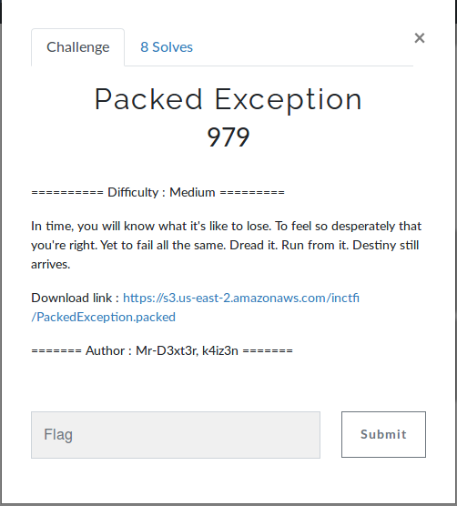

# Packed Exception

**Author** : [D3xt3r](https://twitter.com/ThinkMalicious), [K4iz3n](https://twitter.com/akulpillai)

**Walkthrough** :

1. Unpack the binary

2. Input of 18 chars

3. First Check ("TH@")

4. Second Check ("\_K!")

5. Third Check ("n0$")

6. Fourth Check ("cpY")

7. Fifth Check ("u3x")

8. Sixth Check ("|wT")

**Input** : T#@n0$\_K!|wtu3xcpY

**flag** : inctf{T#@n0$\_K!||$\_w!t#0uT_@nY_3xc3pT!0n}

**Detailed Writeup**: [Writeup](https://beingmalicious.wordpress.com/2018/10/19/packed-exception/)
