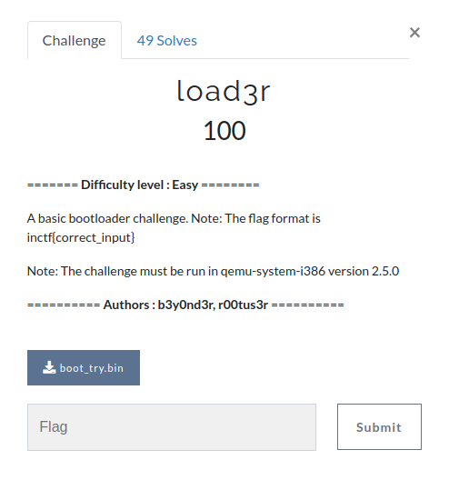

# load3r
  

**Challenge File**: [boot_try.bin](Handout/boot_try.bin)  

**Authors**: [b3y0nd3r](https://twitter.com/GeethnaTk), [r00tus3r](https://twitter.com/r00tus3r)

**Write-up**:
This was a very basic bootloader challenge. All you have to do is execute the MBR file using some emulator like qemu. The file asks us to enter the flag. It will show whether it is right or not. Looking at the binary all you have to do is load it into IDA and understand the instructions. The input length should be 34 characters long. Then each character of the input in accordance with its position (and a given bitstring) is shifted right or left. Then each character is xored with 5. It is then compared with the given string taken in reverse. That is it!!!
