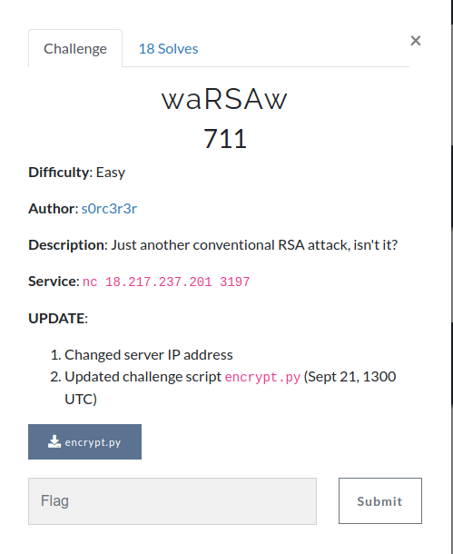

# waRSAw
  

**Challenge File archive**: [Handout/](Handout/)  

**Author**: [s0rc3r3r](https://twitter.com/ashutosha_)  

**Write-up**: [Intended solution by challenge author](https://blog.bi0s.in/2019/09/29/Crypto/PubKey-Enc/InCTFi19-waRSAw/)  

**Short solution**: Variant of Least Significant Bit Oracle attack on unpadded RSA

**Exploit script**:
1. [Variant of LSBit oracle attack](Admin/exploit_optimised.py)
