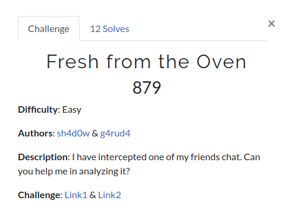

# Fresh from the Oven

**Challenge file archive**: [challenge.pcapng](Handout/challenge.pcapng)

**Authors**: [Sh4d0w](https://twitter.com/__Sh4d0w__) & [g4rud4](https://twitter.com/NihithNihi)

**Short solution**:

+ Decoding the strings found in TCP stream 0.
+ Analysing and extracting data sent via different ports of TCP.
+ Using character-wise caesar from the extracted data.
+ Zip cracking

**Writeup**: 

+ [blog.bi0s.in](https://blog.bi0s.in/2019/10/03/Forensics/InCTFi19-FreshFromTheOven/)
+ [Nihith's blog](https://bolisettynihith.github.io/2019/10/03/InCTFi19-Fresh-From-the-Oven/)