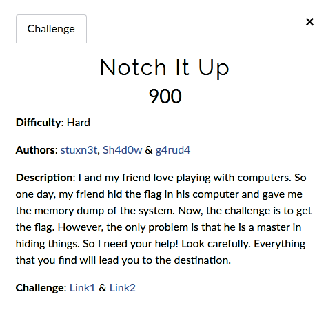

# Notch It Up

**Challenge file archive**: [Google drive](https://drive.google.com/file/d/1bER4wmHP_LAMgdB52LGkb8x2Mf8hG3V6/view)

**Authors**: [stuxn3t](https://twitter.com/_abhiramkumar), [Sh4d0w](https://twitter.com/__Sh4d0w__) & [g4rud4](https://twitter.com/NihithNihi)

**Short solution**

+ Chrome history analysis
+ File recovery from the memory dump
+ Raw analysis of email content
+ Environment variables analysis
+ RAR password cracking
+ Corrupted file analysis

**Writeup**

+ [blog.bi0s.in](https://blog.bi0s.in/2019/09/24/Forensics/InCTFi19-NotchItUp/)
+ [Abhiram's blog](https://stuxnet999.github.io/inctfi/2019/09/04/InCTFi19-NotchItUp.html)