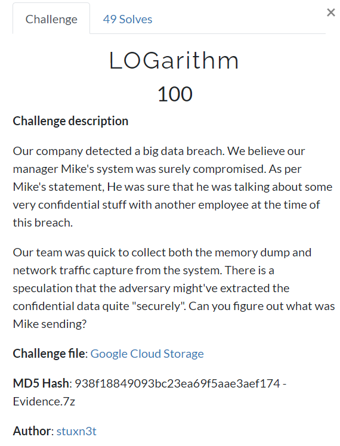

# LOGarithm

**Challenge file**: [Google drive](https://drive.google.com/file/d/13jqNNjlYjrcAaIdmq77sd2HkE6athVJg/view?usp=sharing)

**Author**: [stuxn3t](https://twitter.com/_abhiramkumar)

**Short writeup**

+ Extract the keylogger script.
+ Extract the malicious env set by the attacker.
+ Extract the encrypted data from the PCAP.
+ Reverse the python script using the data collected above and get the flag.

**Writeup**

+ [blog.bi0s.in](https://blog.bi0s.in/2020/08/04/Forensics/InCTFi-LOGarithm/)
+ [Abhiram's blog](https://stuxnet999.github.io/inctfi/2020/08/05/InCTFi-LOGarithm.html)