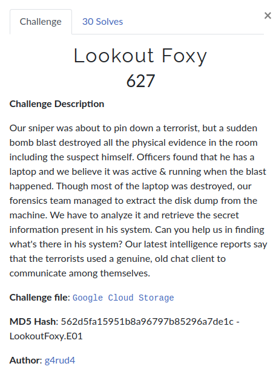

# Lookout Foxy



**Challenge file**: [Google drive](https://drive.google.com/drive/folders/1EICM8RCZB4jHm63M6Y2Dua2Ir8zOaj5B?usp=sharing)

**Author**: [g4rud4](https://twitter.com/NihithNihi)

**Short Writeup**

+ Decrypt the message file found in the Outlook Express using the private key Stored on the device.
    + PATH: Program Files/GPG/ (Key)
    + PATH: Crimson/Local Settings/Temporary Internet Files
+ Decrypt the saved passwords file(logins.json) using **pwdecrypt** and necessary files(cert8.db, key3.db, permissions.sqlite) all stored in the same folder.

```bash
$ jq . < logins.json
$ jq -r -S '.logins[] | .hostname, .encryptedUsername, .encryptedPassword' logins.json | pwdecrypt -d .
```

+ Use the decrypted password details for logging in to website he accessed.

**Writeup**
+ [blog.bi0s.in](https://blog.bi0s.in/2020/08/03/Forensics/InCTFi20-LookoutFoxy/)
+ [Nihith's blog](https://g4rud4.gitlab.io/2020/InCTFi20-LookoutFoxy/)
